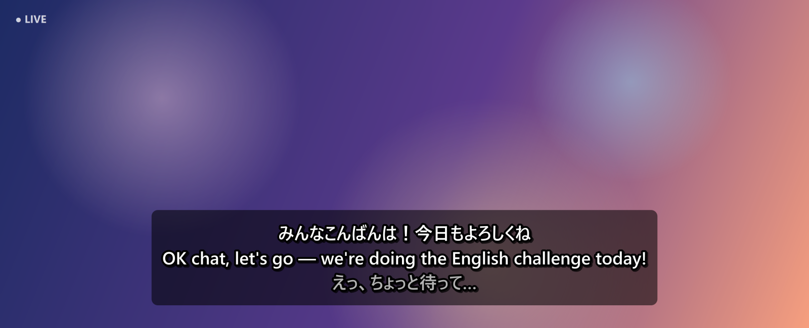
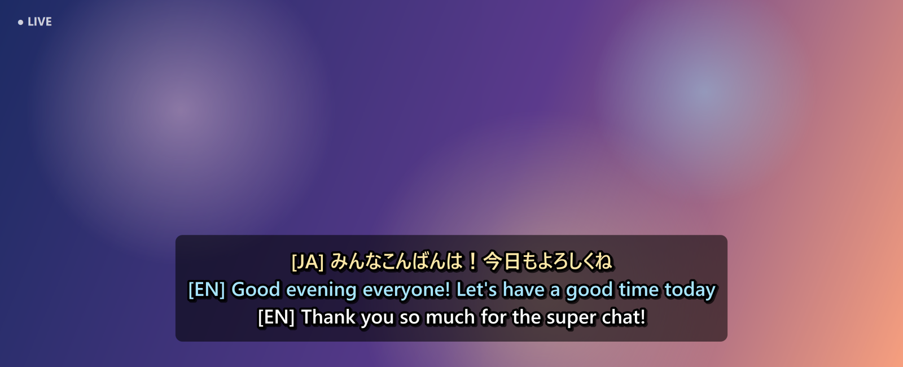
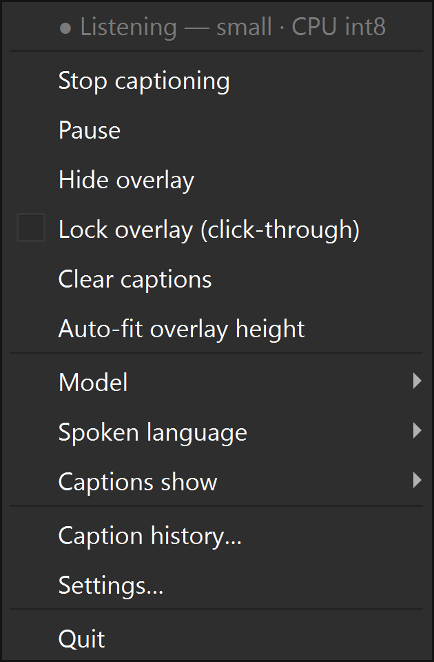
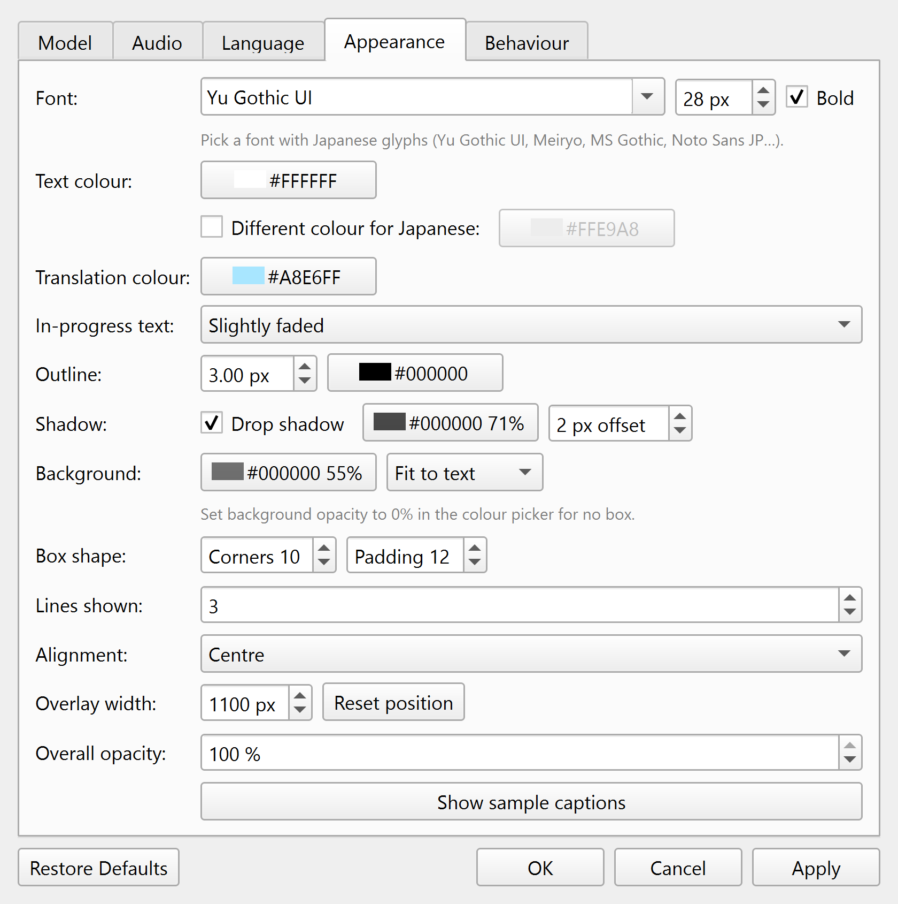
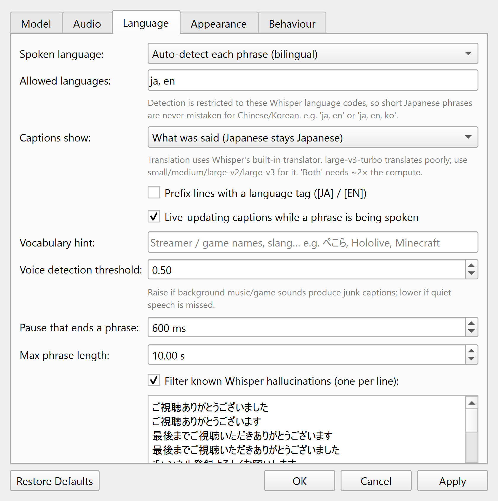
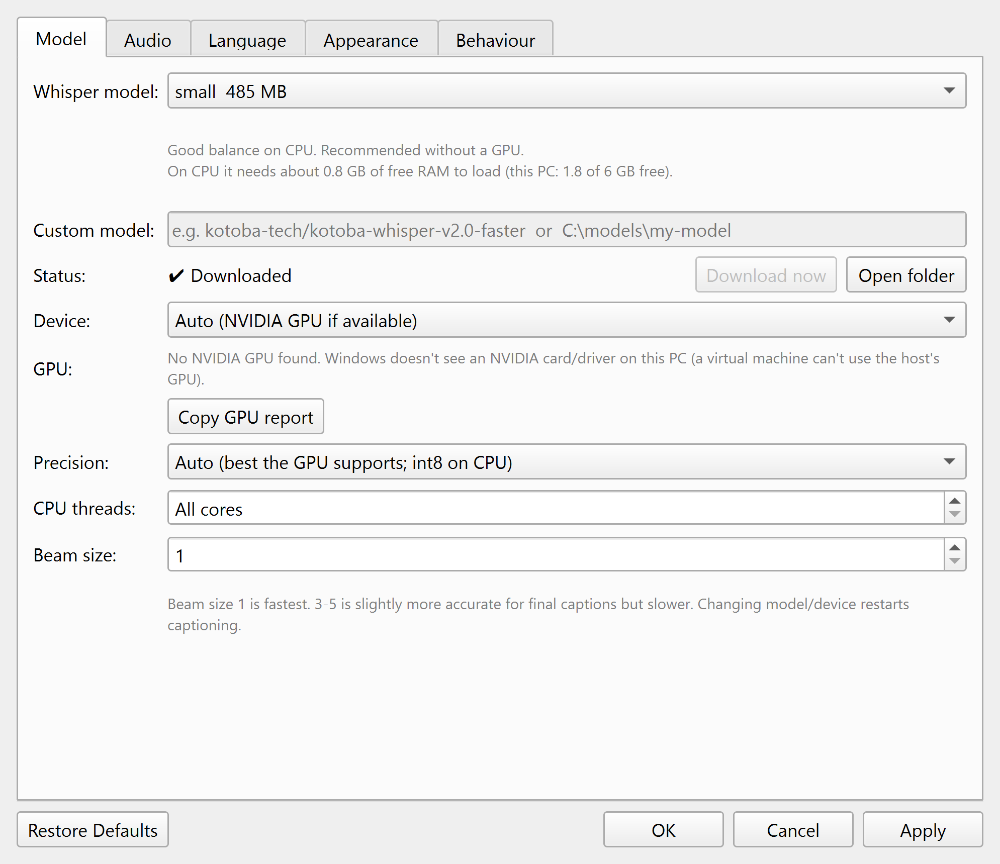
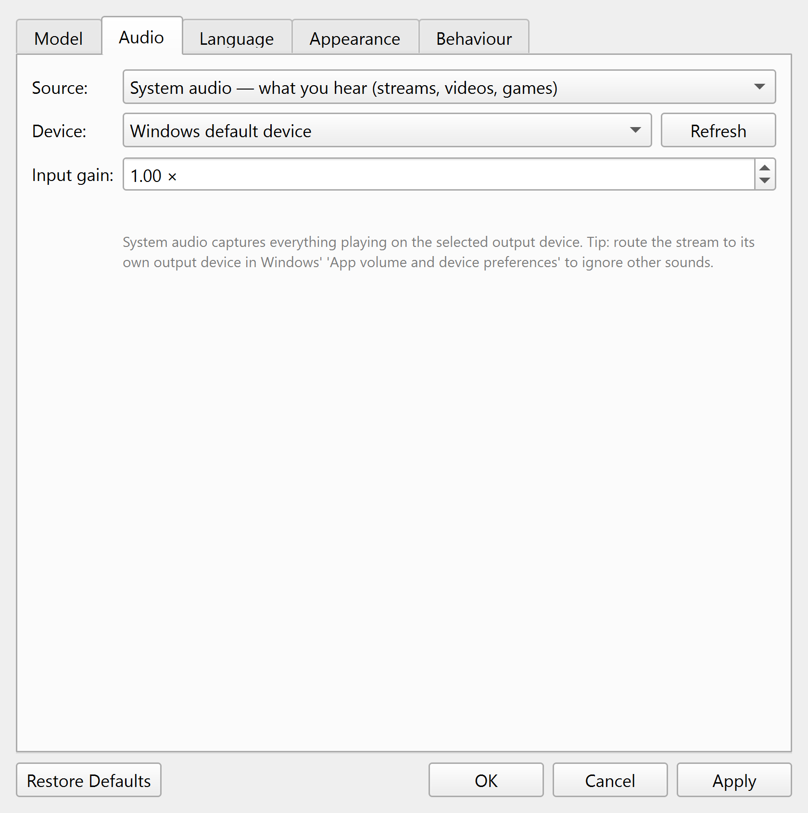
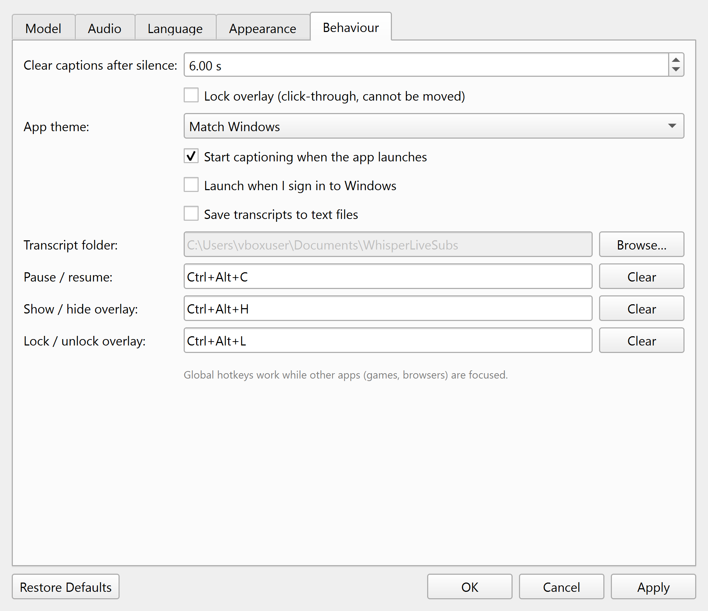

# Whisper Live Subs

Live captions for anything playing on your PC, powered by OpenAI's Whisper models
(via [faster-whisper](https://github.com/SYSTRAN/faster-whisper), the same weights running on CTranslate2, about 4× faster).
It was built for Japanese streamers who switch between Japanese and English: the language
is detected **per phrase**, so a stream can go back and forth freely.

The app lives in the **system tray** (the blue 字 icon) and draws captions in an always-on-top
overlay that floats over every window, including browsers, players and borderless-fullscreen games.



<table>
<tr>
<td></td>
<td></td>
</tr>
<tr>
<td align="center"><em>"Original + English" mode with language tags</em></td>
<td align="center"><em>Restyled: no box, coloured outline, Meiryo</em></td>
</tr>
</table>

## Download (no Python needed)

Grab `WhisperLiveSubs-<version>-win64.zip` from [Releases](../../releases), extract it anywhere, and run
**`WhisperLiveSubs.exe`**. It's portable: models download into the `models` folder next to the exe on first use.
Windows SmartScreen may warn because the exe is unsigned: click *More info* → *Run anyway*.

The exe build runs on the CPU. For NVIDIA GPU acceleration, use the Python version below.

## Run from source

Double-click **`Whisper Live Subs.bat`**. On a fresh machine it runs `setup.bat` first, which creates
`.venv` and installs the dependencies.

- **Move** the overlay: drag it. **Resize**: drag its left or right edge. **Font size**: Ctrl+mouse wheel.
- **Lock** it (tray → *Lock overlay*, or `Ctrl+Alt+L`) to make it click-through so it never gets in the way.
- **Double-click** the tray icon or overlay to open Settings. Right-click either one for the menu.

| Default hotkey | Action |
|---|---|
| `Ctrl+Alt+C` | Pause / resume captions |
| `Ctrl+Alt+H` | Show / hide the overlay |
| `Ctrl+Alt+L` | Lock / unlock the overlay |

## Choosing a model

| Model | Download | Notes |
|---|---|---|
| tiny / base | 75 / 145 MB | Fast but rough, especially for Japanese |
| **small** | 485 MB | Default. Best accuracy that keeps up live on a CPU |
| medium | 1.5 GB | Clearly better Japanese. Needs a fast CPU or any NVIDIA GPU |
| **large-v3-turbo** | 1.6 GB | Best choice with an NVIDIA GPU. Weak at *translation* |
| large-v2 / large-v3 | 3 GB | Most accurate. GPU strongly recommended |

Models download automatically on first use into `models/`. You can also pre-download them from
Settings → Model. *Custom* accepts any CTranslate2 Whisper model, either a Hugging Face repo id
or a local folder.

### NVIDIA GPU

`setup.bat` installs the CUDA libraries automatically when it finds an NVIDIA GPU. To add them by hand:

```bash
.venv\Scripts\python -m pip install -r requirements-gpu.txt
```

Device = *Auto* then uses the GPU. If the GPU fails, the app falls back to CPU and tells you.

## Language options (Settings → Language)

- **Spoken language**: *Auto-detect each phrase* (bilingual), *Japanese only*, or *English only*.
  Auto-detect only considers the **allowed languages** (`ja, en`), so short Japanese clips are never
  mistaken for Chinese. It also slightly favours the language the streamer was just speaking, which
  keeps one-word replies like "うん" or "yeah" stable.
- **Captions show**: what was said; English (Japanese gets translated); or both, with the
  translation underneath in its own colour.
- **Vocabulary hint**: streamer, game and member names help Whisper spell them correctly.
- **Voice detection threshold / pause / max phrase length**: tune these for music-heavy streams.
- **Hallucination filter**: drops Whisper's classic junk on silence or music
  (e.g. 「ご視聴ありがとうございました」). The list is editable.

Other options include font, size, bold, text/Japanese/translation colours, outline, shadow,
background colour and opacity, box shape, lines shown, alignment, width, auto-clear delay,
transcript saving, caption history window, launch at Windows sign-in, and the global hotkeys.

## Screenshots

| Tray menu | Appearance | Language |
|---|---|---|
|  |  |  |

| Model | Audio | Behaviour |
|---|---|---|
|  |  |  |

### Updating the screenshots

Everything in `docs/` is rendered from the real widgets by a script, not captured from the screen. It uses
default settings, so the images never show your desktop, other windows or your saved preferences. It works
while the app is running. After changing the UI, regenerate them:

```bash
.venv\Scripts\python tools\make_screenshots.py
```

To add a new shot, add a call to `overlay_shot(...)` (captions on the demo backdrop) or a `widget.grab().save(...)`
in [tools/make_screenshots.py](tools/make_screenshots.py), then reference the file from this README.

## Tips

- To caption only the stream and not Discord or game audio, send the browser to a separate output
  device (Windows *App volume and device preferences*). Then pick that device in Settings → Audio.
- Settings live in `%APPDATA%\WhisperLiveSubs\settings.json`. The log for the windowless
  launcher is in `log.txt` in the same folder.
- Exclusive-fullscreen games draw over every overlay. Use borderless/windowed fullscreen.

## Files

```
Whisper Live Subs.bat   launcher (no console)
setup.bat               one-time dependency install
livesubs/engine.py      VAD + streaming Whisper + per-phrase language detection
livesubs/audio.py       WASAPI loopback / microphone capture → 16 kHz mono
livesubs/overlay.py     caption window (outlined text, click-through, drag/resize)
livesubs/settings_dialog.py, app.py, hotkeys.py, config.py
tools/make_screenshots.py   regenerates docs/*.png
tools/build_exe.py          builds the standalone exe + zip (pip install pyinstaller first)
```
